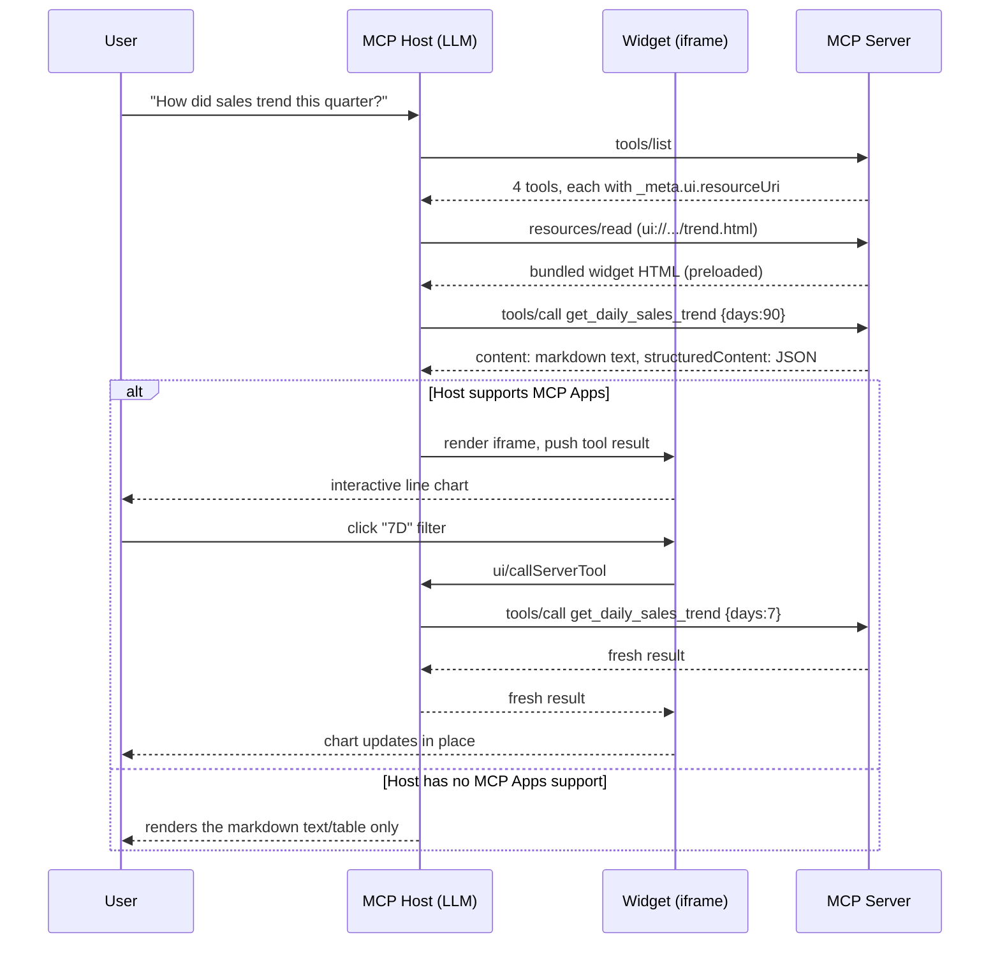

# Architecture

A deeper look at how this POC is put together, how to configure it, and how it
would need to evolve to serve real sales data to real enterprise users. For
quick setup, see [README.md](./README.md).

## 1. Main components

```
┌─────────────────────────────────────────────────────────────────────┐
│ MCP Host (Claude Desktop / Claude web / ChatGPT / M365 Copilot)      │
│   - runs the LLM, decides which tool to call from the user's prompt  │
│   - renders content (markdown) always                                │
│   - renders the ui:// widget in a sandboxed iframe, if it supports   │
│     MCP Apps                                                         │
└───────────────┬───────────────────────────────────┬──────────────────┘
                │ MCP (JSON-RPC): tools/list,        │ postMessage (JSON-RPC
                │ tools/call, resources/read          │ dialect): ui/initialize,
                │ over stdio or Streamable HTTP        │ tools/call, tool results
                ▼                                     ▼
┌───────────────────────────────┐       ┌───────────────────────────────┐
│ server/  (Node, runs once,     │       │ ui/  (bundled once at build    │
│  long-lived per connection)    │       │  time, served as static HTML)  │
│                                 │       │                                 │
│  main.ts    — transport switch │       │  apps/<tool>/main.tsx           │
│  server.ts  — registers 4      │──────▶│    useSalesApp() → useApp()     │
│    tool+resource pairs         │ serves │    from @modelcontextprotocol/  │
│  mockData.ts — seeded mock     │  HTML  │    ext-apps/react — connects to │
│    dataset + aggregation       │        │    the host, receives the tool │
│  format.ts  — markdown         │        │    result, can call more tools │
│    fallback text               │        │                                 │
│                                 │        │  shared/  BarChart, LineChart,  │
│                                 │        │    theme.css, Filters, format   │
└───────────────────────────────┘       └───────────────────────────────┘
```

- **`server/main.ts`** — process entry point. Picks a transport: stdio (for a
  host-spawned local process, e.g. Claude Desktop) or Streamable HTTP on
  `/mcp` (for anything that needs a URL: Claude web, ChatGPT, Copilot, the
  `basic-host` test harness, a tunnel).
- **`server/server.ts`** — the actual MCP server definition. For each of the 4
  tools it calls `registerAppTool` (tool + `_meta.ui.resourceUri` pointing at
  a `ui://` resource) and `registerAppResource` (serves the built widget HTML
  for that URI). This file is the single place that wires "a query" to "a
  chart."
- **`server/mockData.ts`** — the only stand-in for a real backend. A seeded
  PRNG builds 200 days of daily totals once at process start; every tool call
  slices/aggregates from that fixed in-memory dataset. No I/O, no network, no
  auth.
- **`server/format.ts`** — turns the same aggregated data into a markdown
  table/summary. This is what every host shows in `content`, regardless of
  whether it can render the widget.
- **`ui/apps/<tool>/main.tsx`** — one React entry per tool, built by Vite +
  `vite-plugin-singlefile` into a single self-contained HTML file (inline
  JS/CSS, no external requests — this is what lets the resource ship with a
  deny-by-default iframe CSP). Uses `useApp`/`useSalesApp` to connect to the
  host, read the pushed tool result, and re-call the tool when the user
  touches an in-widget filter.
- **`ui/shared/`** — the chart kit shared by all 4 widgets: hand-rolled SVG
  `BarChart`/`LineChart` (no charting library dependency, styled against the
  palette in `theme.css`), `Filters` (segmented control / toggle), and
  `useSalesApp` (the `useApp` wrapper that every widget uses identically).

## 2. How it connects — request flow



The key design point: **the server never knows or cares which path is taken.**
Every tool call always returns both `content` (text) and `structuredContent`
(the same data as typed JSON); which one the user sees is decided entirely by
the host. That's what makes the fallback "graceful" rather than a special
code path to maintain.

## 3. Configuration

| Want to change... | Where |
|---|---|
| Mock business shape (regions, channels, products, reps, their weights) | `server/mockData.ts` — `REGIONS`/`CHANNELS`/`PRODUCTS`/`REPS` arrays |
| How much history is generated / the random seed | `server/mockData.ts` — `HISTORY_DAYS`, `SEED` |
| A tool's allowed input range (day windows, topN caps) | `server/server.ts` — the `z.number()...` bounds in each `inputSchema` |
| A tool's natural-language description (affects which tool the LLM picks) | `server/server.ts` — the `description` string per tool |
| The markdown fallback layout | `server/format.ts` |
| HTTP port | `PORT` env var (default `3001`), read in `server/main.ts` |
| Transport (stdio vs HTTP) | the `--stdio` CLI flag to `server/main.ts` |
| Chart colors / light-dark theme | `ui/shared/theme.css` — CSS custom properties, sourced from the dataviz skill's validated palette |
| Client-side copies of region/channel names (must match `mockData.ts`) | `ui/shared/constants.ts` |
| Which widget file is bundled in a given build step | `INPUT` env var per `npm run build:<widget>` script, consumed by `vite.config.ts` |

**Adding a 5th tool/widget** touches: a new `getX` + type in `mockData.ts`, a
`formatX` in `format.ts`, a `registerAppTool`/`registerWidget` pair in
`server.ts`, a new `ui/<name>.html` + `ui/apps/<name>/main.tsx`, a new
`build:<name>` script in `package.json`, and its rollup entry in
`vite.config.ts`.

## 4. Build & run

```bash
npm install
npm run build          # bundles all 4 widgets to dist/ui/*.html
```

```bash
npm run serve          # Streamable HTTP → http://localhost:3001/mcp
npm run serve:stdio    # stdio transport
```

**Claude Desktop** (stdio, no tunnel — the host spawns the process itself):

```json
{
  "mcpServers": {
    "sales-insights": {
      "command": "npx",
      "args": ["tsx", "server/main.ts", "--stdio"],
      "cwd": "D:\\Projects\\IDEA-PROJECTS\\income-mcp"
    }
  }
}
```

**Tunneling** (needed for anything that connects over a URL instead of
spawning a local process — Claude web, ChatGPT, Copilot, or just testing the
HTTP path yourself):

```bash
npm run serve
npx cloudflared tunnel --url http://localhost:3001
```

`cloudflared` prints a `https://<random-name>.trycloudflare.com` URL. Add
`<that-url>/mcp` as a custom/remote connector in the host. Two things worth
saying out loud in the demo:

- The tunnel makes your laptop's port briefly reachable from the public
  internet for as long as the command runs. That's acceptable here because
  the server holds no real data and requires no auth — **do not reuse this
  tunneling approach once real data is behind it** (see §5).
- Kill the `cloudflared` process when the demo is over; the URL is
  unauthenticated and open to anyone who has it while the tunnel is up.

## 5. Extending this POC to a real enterprise use case

Everything below is what's cut for the demo and would need to come back for
production. Roughly in the order it'd bite you:

### Real data instead of `mockData.ts`
Replace the mock module with a real data-access layer behind the *same
function shapes* (`getDailyTrend`, `getSalesByRegion`, ...) so `server.ts`
doesn't change: a repository that queries the sales data warehouse (Snowflake/
BigQuery/Redshift) or a CRM API (Salesforce, HubSpot, Dynamics). Keep
aggregation server-side — never ship raw row-level data to the widget if the
chart only needs daily/region/product/rep totals.

### AuthN — know who's asking
Right now the server trusts every caller completely. A production MCP server
over HTTP needs the [MCP-specified OAuth 2.1 flow](https://modelcontextprotocol.io/specification/latest/basic/authorization):
the host does an OAuth handshake against your authorization server (fronting
your enterprise IdP — Okta, Entra ID/Azure AD, etc.), and every `tools/call`
arrives with a bearer token identifying the real employee, not just "some
Claude user." stdio-local setups (Claude Desktop) inherit the OS user's
identity instead, which still needs to be mapped to an internal identity.

### AuthZ — know what they're allowed to see
Token claims (user id, role, team, territory) need to drive query filtering,
not just UI visibility:
- A rep querying `get_sales_leaderboard` sees their own pipeline; a manager
  sees their team; an exec sees the org. Enforce this in the data layer, so a
  clever prompt can't talk the LLM into asking for someone else's numbers.
- Declare tool-level scopes (`sales:read:own`, `sales:read:team`,
  `sales:read:org`) and check them before running the query, the same way an
  API gateway would gate a REST endpoint.
- Consider row-level security at the warehouse layer as the last line of
  defense, not just application-level filtering.

### Governance, audit, and PII
Every tool call now flows customer/rep names and revenue figures through a
third-party AI host (Claude/ChatGPT/Copilot). That needs: audit logging of
every tool invocation (who, what args, when) to your SIEM; a masking policy
for names/customer identifiers depending on role; and a data-classification
review before this ships to a regulated business unit.

### Multi-tenancy
If multiple business units or subsidiaries share one deployment, derive a
tenant id from the token and scope every query by it — don't rely on the LLM
to "ask nicely" for the right tenant.

### Deployment & connector registration
Ad hoc `cloudflared` tunnels and user-added custom connectors are a demo
convenience, not a rollout plan. For real use: containerize the server,
deploy behind your API gateway with TLS and the OAuth flow above, and
register it as an **admin-approved** connector — Claude's connector
allowlisting for Team/Enterprise plans, an OpenAI/ChatGPT Enterprise
connector allowlist, or a Microsoft 365 Copilot agent registered through
Copilot Studio/the Teams admin center — rather than something each user adds
individually.

### Observability & resilience
Structured logging and tracing (OpenTelemetry) across every tool call; usage
and latency metrics; rate limiting per user (an LLM agent can retry a tool in
a loop); a caching layer (Redis) in front of expensive aggregations; and a
CI eval harness that checks tool descriptions/schemas still route correctly
after any change, since those strings are effectively a contract with the LLM
and drift silently otherwise.

### Widget/CSP hardening
The POC's iframe needs zero external network access because everything is
inlined. A real widget that wants a live-refreshing dashboard or your
company's asset CDN needs an explicit, security-reviewed `_meta.ui.csp`
allowlist instead of relying on "nothing external ever loads."

### Richer interactions
Once real data and auth are in place, the same bidirectional-tool-call
pattern used for the filter controls extends naturally to drill-down (click a
bar → call a tool for account-level detail) and to delegated actions ("email
this chart to my manager," "schedule a pipeline review") routed through
whatever the host already has connected — the value case MCP Apps is actually
built for, beyond just chart rendering.
